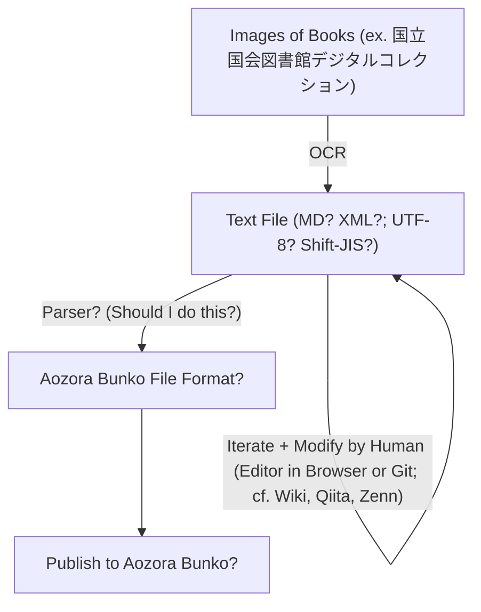

Aoarash.org / Seiran.org
> *青嵐: 青空の下に吹き抜ける一陣の山気．*

- デジタル文書化された国立国会図書館のIIIF API等を用いて，NDL-OCR+人間による修正とGitのようなバージョン管理でつくるクラウドソーシングな次世代の青空文庫．
- 将来的にそれらの修正データをdeep learningの学習assetとして活用し，デジタルアーカイブの文書化精度を向上させる正の循環を作りたい．
- 将来的な青空文庫への収蔵を想定してファイルの互換性を持たせるが，完全な互換は目指さずあくまでもWebにavailableな信頼できるパブリックドメインライブラリーを作ることが目的．
- 商用のAI学習アセットへのスクレイピングは禁止，ソフトウェア自体にも強めのライセンスをつける（GPL等）．
  - 機械的な統計処理がサーバを圧迫することによって人間によるアクセスが保証出来ない状態を避けるため．
  - 商用には有料の機械学習向けに最適化されたassetを提供し，運営費とする．
  - 元のNDLなどの利用規約と衝突しないように留意．
- 持続可能なものにするべく，依存ライブラリやベンダーロックインは少なく．

## 目的
- 将来的な青空文庫への収蔵も視野にいれつつ，独自のサイクルで既にデジタルアーカイブとしてインターネットに画像がある書籍のテキストデータ化
  - => Kindleなどで誰でも読める; EPUB, PDF
  - => 洗練されたリーダー
- 公開後も間違いがあればすぐに修正: Wikipediaくらい迅速に反映 with 荒らし対策
  - 作業状況が%で見られる，作業がすんでいないものも，フィルターすれば一覧で見られる
- 既存の青空文庫も取り込み，必要に応じて修正（源流を尊重してmerge）
- GitLab
- GNU
- NDL OCR
  - OCR精度の向上に寄与できたら最高，最終的なゴールはテキスト化は計算機がしてくれて，人間は文筆と読むことを楽しめること！
  - 一方で耕作自体を楽しんでいる人もいるはずなので，そうした人たちが新たに手にしたmassiveなデジタルアーカイブで出来る楽しいことも将来的には企画していかなければ．

## In my mind...🤔

1. Use Existing Aozora Bunko Files as Training Data
   - We can find original texts since Aozora Bunko shows the original version of the texts ("底本").
   - Supervised learning with these data

## This Project consists of...

1. Text Recognition
   - OCR with Python
   - Aim to generate texts accurately and quickly also in Japanese vertical texts
1. Viewer/Editor
   - Simple and Fast Viewer and Editor working on Browser
   - Anyone can modify the generated texts either in the Built-in Editor or GitHub (Can we compare the original pictures and the generated texts?)
   - Can this editor be built with Python as well?
1. Text Matching Game
   - Matching Game for Japanese Texts
   - Aim to improve the accuracy of OCR (also for fun, of course!)
   - This game can be a learning material for Japanese learners (like [the original concept of Duolingo](https://www.ted.com/talks/luis_von_ahn_massive_scale_online_collaboration))
   - cf. Google Captcha

## Related Projects

- [aozorahack](https://github.com/aozorahack)
  - [Web Page](https://aozorahack.org)
  - [ideathon](https://github.com/aozorahack/ideathon): There are many ideas similar to this project!
  - [kosakuin](https://github.com/aozorahack/kosakuin): Aozora Bunko Editor (MIT License)
  - [aozora-cli](https://github.com/aozorahack/aozora-cli): Aozora Bunko CLI (MIT License)
  - [aozora-parser.js](https://github.com/aozorahack/aozora-parser.js)
  - [aozoraflow](https://github.com/aozorahack/aozoraflow)
- [kyukyunyorituryo/AozoraEditor: 青空文庫エディタ](https://github.com/kyukyunyorituryo/AozoraEditor)
- [kyukyunyorituryo/html2aozora](https://github.com/kyukyunyorituryo/html2aozora)
- [gearsns/AozoraJavaScriptParser](https://github.com/gearsns/AozoraJavaScriptParser)